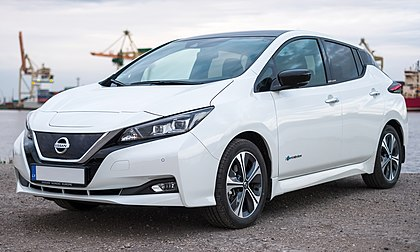

# Recognising nissan leaf: Which model is which.

I am not an expert. This is the result of my searching.

- [Mark 1 (2011→2017)](#mk1)

- [Mark 2 (2017→at least 2022)](#mk2)

# <a id="mk1">MK1</a>

## 2011/12
### General Features
- Small bad battery
- Range 109 miles

## 2013

### Visia
- The interior upholstery is mostly cream in colour.
- No alloy wheels
- Old heater
- No Eco mode
- Range 124 miles

### Acenta
- The most notable change is the black cloth upholstery with the dashboard to match.
- CHAdeMO socket
- Eco button, on steering wheel
- Sat nav

### Tekna
- 360° Cameras
- 17¨ alloy wheels vs 16¨ for other trim levels.
- LED headlights
- Bose speaker system
- Heated seats, and steering wheel
- Parking assist

### General Features
- small bad battery (some)
- Heat pump cabin heater (some)
- Better regen

## 2024/15
- Rear view monitor
- Better computer

## 2016

## 2017

## Checks:
- SD card (May be a different type of card) on entertainment system. Check not missing.

###Recalls
- Steering column clip: 2013 and 2014 cars
- Start button fault:  between September 2013 and January 2014
- Automatic headlight aim: February and March 2017.

# <a id="mk2">MK2</a>

## 2017