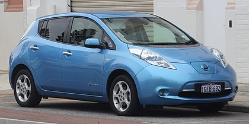

# MK1

## 2011→12
### General Features
- Small bad battery
- Range 

## 2013

### Visia
- The interior upholstery is mostly cream in colour.
- No alloy wheels
- Old heater
- No Eco mode
- Range

### Acenta
- The most notable change is the black cloth upholstery with the dashboard to match.
- CHAdeMO socket
- Eco button, on steering wheel
- Sat nav

### Tekna
- 360° Cameras
- 17¨ alloy wheels vs 16¨ for other trim levels.
- LED headlights
- Bose speaker system
- Heated seats, and steering wheel
- Parking assist

### General Features
- Small bad battery (some)
- Heat pump cabin heater (some)
- Better regen

## 2014→15
- Rear view monitor
- Better computer
- A larger 30kWh battery arrived in 2015 to deliver a range of.

## 2016

## 2017

## Range

> ##2011→12
> - 117 km (73 miles) EPA
> - 175 km (109 miles) NEDC
>
> ##2013
> - 121 km (75 miles) EPA
> - 200 km (120 miles) NEDC
>
> ##2014→15
> - 135 km (84 miles) EPA
>
> ##2016
> - with 24 kWh battery 135 km (84 miles) EPA
> - with 30 kWh battery 172 km (107 miles) EPA
>
> <cite>[Wikipedia (2022-05-30)](https://en.wikipedia.org/wiki/Nissan_Leaf#First_generation_(ZE0/AZE0;_2010\))</cite>

## Checks:
- SD card (May be a different type of card) on entertainment system. Check not missing.

### Recalls
- Steering column clip: 2013 and 2014 cars
- Start button fault:  between September 2013 and January 2014
- Automatic headlight aim: February and March 2017.
